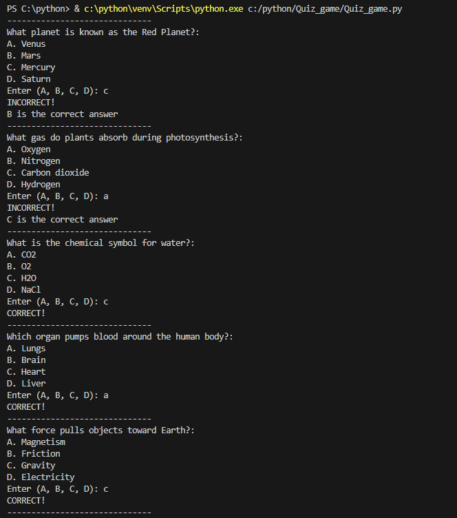
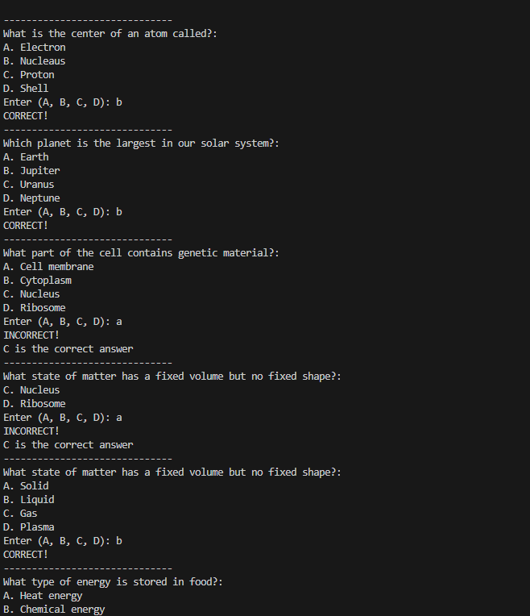
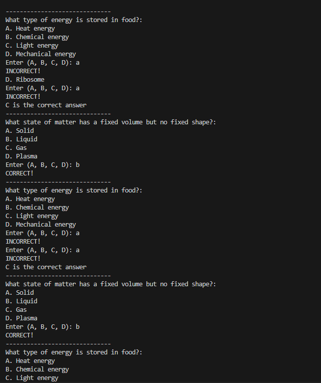
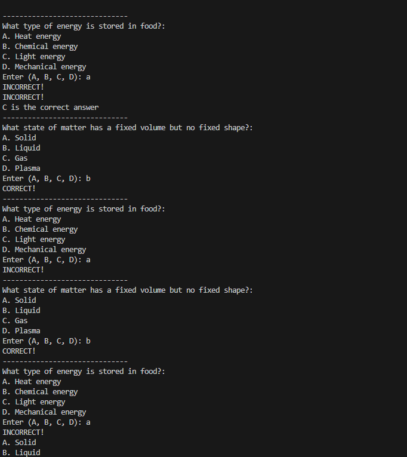
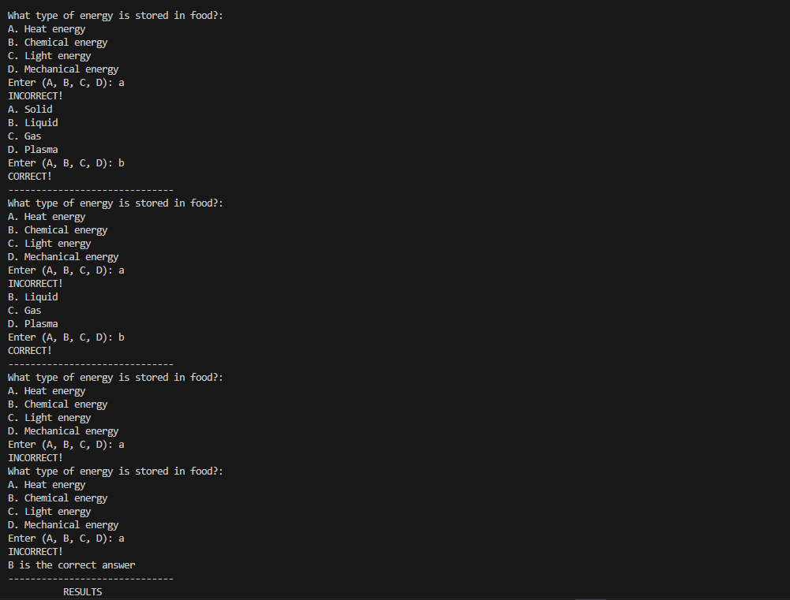
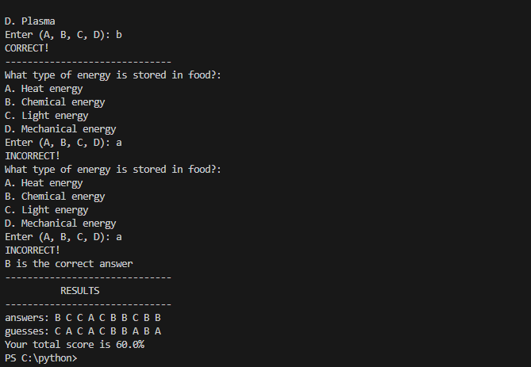

# Quiz Game

## Description

    This app generate questions with options for the users to pick from and tells whether it is write or wrong and then gives the percentage depending on how many questions the user gets right.

## Steps taken to develop the project

1. First step is to create an array which consists of of th equestions and another to contain the options and also the answer.

2. create an empty variable of guesses and set the score and question number be zero.

3. Then print the question so the users can also choose the answer.

4. The next step is to let the user know if they are correct when they choose an answer

5. Also if they are wrong they should move onto the next question and answer to the previous qestion should be revealed.

6. Final step after answering all the question the result of the user will be shown to the users.

## OUTCOME

